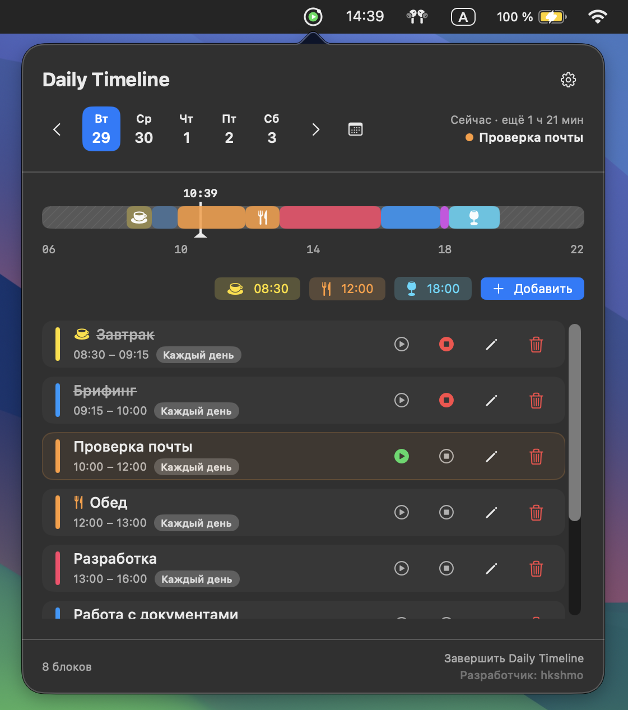
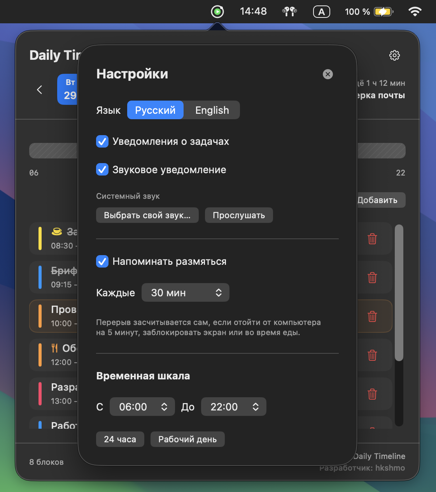

# Daily Timeline

Планировщик дня в строке меню macOS: весь день на одной временной шкале, задачи по расписанию и напоминания, чтобы не пропустить важное.

| Шкала дня и задачи | Настройки |
|:---:|:---:|
|  |  |

## Возможности

- **Шкала дня** с линией «сейчас» и свободным временем
- **Повторяющиеся задачи**: каждый день или по выбранным дням недели
- **Автозапуск по расписанию**: задача начинается сама, приходит уведомление, иконка в строке меню показывает, что идёт
- **Завтрак, обед и ужин** в одно нажатие
- **Напоминание размяться** при долгой работе за компьютером
- **Всё хранится только на вашем Mac**: без аккаунтов, облака и интернета

## Установка

1. Скачайте последнюю версию на странице [Releases](../../releases) и распакуйте zip.
2. Перенесите **Daily Timeline** в папку «Программы».

Требуется macOS 14 или новее, Intel или Apple Silicon.

### Первый запуск

Приложение не подписано сертификатом Apple, поэтому при первом запуске macOS его заблокирует.

1. Попробуйте открыть приложение и нажмите «Готово» в предупреждении.
2. Откройте **Системные настройки → Конфиденциальность и безопасность**, прокрутите вниз и нажмите **«Всё равно открыть»** рядом с Daily Timeline.

Или одной командой в Терминале:

```bash
xattr -dr com.apple.quarantine "/Applications/Daily Timeline.app"
```

## Разработка

> Внутреннее имя проекта — Dayline.

Требуется Xcode 16 или новее и Swift 6.

Откройте `Dayline.xcodeproj`, выберите схему **Dayline** и нажмите `⌘R`.

Тесты можно запустить командой:

```bash
swift test
```

## Сборка приложения

В Xcode выберите `Product → Archive`, затем `Distribute App → Custom → Copy App`. Полученный `Daily Timeline.app` можно перенести в папку «Программы».

Release-сборка универсальна для Intel и Apple Silicon. Сборка из терминала:

```bash
xcodebuild -project Dayline.xcodeproj -scheme Dayline -configuration Release -destination 'generic/platform=macOS' build
```

## Структура

- `App` — точка входа и управление menu bar
- `Models` — модели данных
- `Stores` — состояние, бизнес-логика и сохранение
- `Views` — интерфейс SwiftUI
- `Support` — локализация и общие расширения
- `Resources` — App Icon и ресурсы приложения

Данные хранятся локально в `~/Library/Application Support/Dayline/tasks.json`.

Разработчик: **hkshmo**
